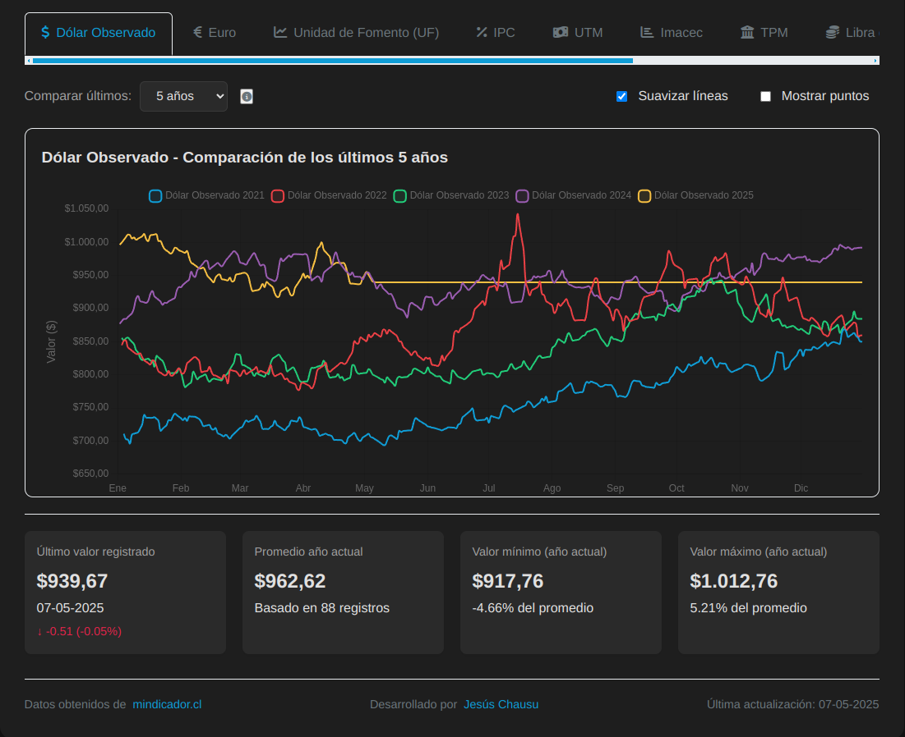

# 🇨🇱 Indicadores Económicos Chile

Una aplicación web sencilla para visualizar y comparar la evolución de los principales indicadores económicos de Chile, consumiendo datos en tiempo real desde la API de [mindicador.cl](https://mindicador.cl/).

<p align="center"></p> 

## ✨ Características Principales

*   📊 **Visualización Dinámica:** Observa la evolución diaria de diversos indicadores económicos chilenos.
*   🔄 **Comparación Anual:** Compara el comportamiento de un indicador a través de diferentes años.
*   📈 **Gráficos Interactivos:** Gracias a Chart.js, explora los datos de forma visual e intuitiva.
*   🔗 **Datos Actualizados:** Información obtenida directamente desde la API de [mindicador.cl](https://mindicador.cl/).

## 🛠️ Tecnologías Utilizadas

*   **Frontend:** HTML5, CSS3, Vanilla JavaScript (ES6+)
*   **Gráficos:** [Chart.js](https://www.chartjs.org/)
*   **Iconos:** [Font Awesome](https://fontawesome.com/)

## 📊 Fuente de Datos

Los datos económicos son consumidos en tiempo real desde la API pública de **[mindicador.cl](https://mindicador.cl/)**.

## 🚀 Uso

Para visualizar la aplicación:
1.  Clona este repositorio:
    ```bash
    git clone https://github.com/jesvald/indicadores-economicos.git
    ```
2.  Navega al directorio del proyecto:
    ```bash
    cd indicadores-economicos
    ```
3.  Abre el archivo `index.html` en tu navegador web preferido.

## 👨‍💻 Autor

Desarrollado por Jesús Chausu.

*   🌐 **Portafolio:** [www.jesuschausu.com](https://www.jesuschausu.com/)
*    **GitHub:** [https://github.com/jesvald](https://github.com/jesvald) 

---

*Si encuentras útil este proyecto, ¡considera darle una estrella ⭐!*